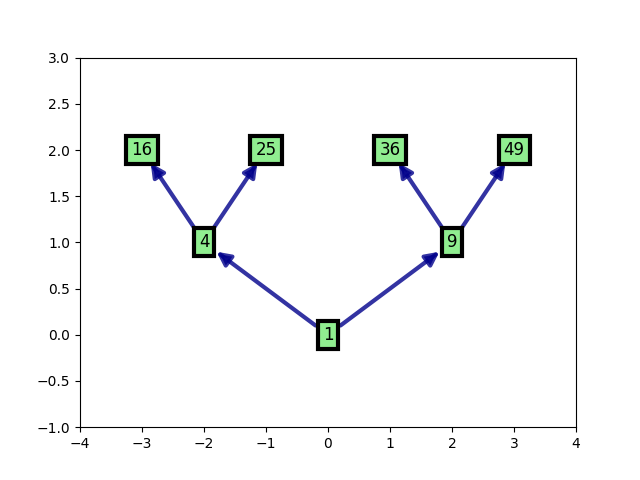
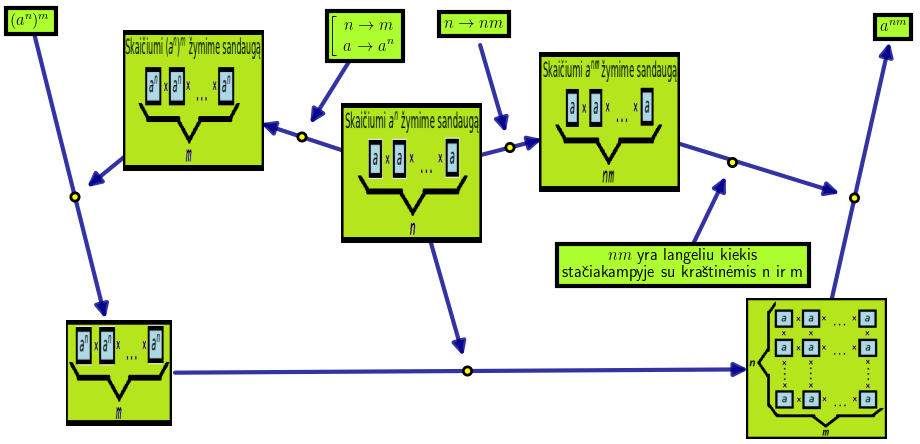

This is a module designed to illustrate schemas of mathematical proofs and solutions.
There is a basic example that demonstrates usage of `neuromap` class instance: 

### Requirements

    matplotlib == 3.3.2
    networkx == 2.5
    numpy == 1.19.2
    scipy == 1.5.2

### Input

    nodes = np.array(['A', 'B', 'C', 'D', 'E', 'F', 'G'])
    edges = np.array([['A', 'B'], ['A', 'C'], ['B', 'D'], ['B', 'E'], ['C', 'F'], ['C', 'G']])
    midpos = []
    pos = np.array([[0, 0], [-2, 1], [2, 1], [-3, 2], [-1, 2], [1, 2], [3, 2]])
    labels = [1, 4, 9, 16, 25, 36, 49]
    sizes = [500, 500, 500, 500, 500, 500, 500]
    images = {'B': 'miku.png', 'E': 'iggraph.png'}
    imsizes = {'B': 0.2, 'E': 0.1}
    
### Usage
    from neuromap import InteractiveGraph
    import numpy as np
    import matplotlib.pyplot as plt
    import networkx as nx
    
    G = nx.DiGraph()
    G.add_nodes_from(nodes) #
    G.add_edges_from(edges) #
    nx.set_node_attributes(G, dict(zip(G.nodes(), pos.astype(float))), 'pos') #
    nx.set_node_attributes(G, dict(zip(G.nodes(), sizes)), 'size') #
    
    IG = InteractiveGraph(G)
    IG.update_nodes()
    IG.update_midnodes()
    IG.labels = labels #
    IG.sizes = {n: 500 for n in nodes}
    IG.images = images #
    IG.imsizes = imsizes #
    IG.refresh()
    plt.show()
    
### Output
This is an output (also of `neuro/neuro.py`):

Another fancy proof schema of mathematical formula `(a^n)^m = a^(nm)` of `neuro1/neuro.py`:

   